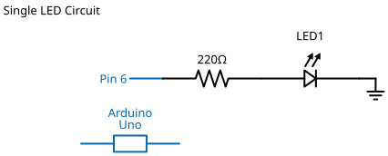

# Mission 1.1: First Light

> **Role**: Lab Apprentice  
> **Objective**: Take control of the system. Send your first command to the microcontroller.

## Result Preview
>
>   
> *The LED will turn ON for 1 second, then OFF for 1 second.*

---

## 1. The Call to Adventure

Welcome to **The Lab**. Before you can build smart cities, you must first master the flow of electricity.

Your challenge is simple but critical: **Command the board to create light.** If you succeed, you prove that you are ready to be an Engineer.

## 2. The Toolkit

Retrieve these items from your kit:

* **1x Arduino Uno** (The Brain)
* **1x LED** (The Output - Any color)
* **2x Jumper Wires** (Red & Black)
* **1x Breadboard** (The Workbench)

## 3. The Blueprint

Construct the circuit exactly as shown.

* **Positive Leg (Long)** -> **Pin 6** (The Signal)
* **Negative Leg (Short)** -> **GND** (The Ground)



*Schematic Diagram — Logical Wiring*


*Breadboard Photo — Physical Assembly Reference*

> [!IMPORTANT]
> **Check your Polarity!** If the LED is backwards, it won't light up. The **Long Leg** must go to Power (Pin 6).

## 4. The Logic

We communicate with the board using C++. Here is the step-by-step logic:

1. **Define**: Give Pin 6 the name `ledPin`.
2. **Setup**: Tell the Arduino "Pin 6 is for Talking (OUTPUT), not Listening".
3. **Loop**:
    * Turn Power **ON** (HIGH).
    * **Wait** 1 second.
    * Turn Power **OFF** (LOW).
    * **Wait** 1 second.

### The Code

```cpp
// Mission 1.1: First Light

const int ledPin = 6; // We are using Pin 6

void setup() {
  // Prepare the pin to send signals out
  pinMode(ledPin, OUTPUT);
}

void loop() {
  digitalWrite(ledPin, HIGH); // Turn ON (5V)
  delay(1000);                // Wait 1 second
  digitalWrite(ledPin, LOW);  // Turn OFF (0V)
  delay(1000);                // Wait 1 second
}
```

### Explaining the lines

* `int ledPin = 6;` -> We create a variable named `ledPin` and set it to 6. Now, whenever we say `ledPin`, the computer knows we mean Pin 6.
* `pinMode(ledPin, OUTPUT);` -> Pins can be inputs (listening) or outputs (talking). We want to talk to the LED, so we set it to **OUTPUT**.
* `digitalWrite(ledPin, HIGH);` -> Send 5V to the pin. **Let there be light!**

## 5. Upload & Test

1. Click **Verify** (Checkmark).
2. Click **Upload** (Arrow).
3. Look at your board. Is the LED on?

## 6. Troubleshooting

* **LED not turning on?**
  * Try flipping the LED. Remember, the **Long leg** must go to Pin 6.
  * Check if the wires are pushed all the way in.
  * Check if you uploaded the code successfully (Look for "Done uploading").
* **Dim light?**
  * Ensure you are using a digital pin (0-13), not an analog pin.

## 7. Extensions & Upgrades

**Challenge**: Can you make it blink faster?

* **Hint**: Change the `delay(1000)` to `delay(200)`.
* **Upgrade**: Add a second LED on Pin 5 and make them blink like a Police Car (Alternating).
