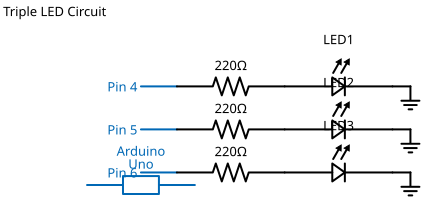

# Mission 1.5: The Triple Beam

> **Role**: Power Grid Monitor  
> **Objective**: Manage high-output zones by lighting three LEDs simultaneously.

## Result Preview
>
>   
> *Red, White, and Yellow LEDs turn ON.*

---

## 1. The Call to Adventure

The main grid is expanding. You now need to manage three power zones at once.
Your mission is to prove that your brain (Arduino) can handle the load of three simultaneous signals.

## 2. The Toolkit

* **3x LEDs** (Red, White, Yellow)
* **1x Arduino Uno**
* **6x Jumper Wires**
* **1x Breadboard**

## 3. The Blueprint

* **Red**: Pin 6
* **White**: Pin 5
* **Yellow**: Pin 4
* **GND**: Common Ground for all.



*Schematic Diagram — Logical Wiring*


*Breadboard Photo — Physical Assembly Reference*

## 4. The Logic

**Algorithm:**

1. **Define**: Pins 6, 5, and 4.
2. **Setup**: All three to `OUTPUT`.
3. **Loop**: Turn all three `HIGH`.

### The Code

```cpp
// Mission 1.5: The Triple Beam
const int z1 = 6;
const int z2 = 5;
const int z3 = 4;

void setup() {
  pinMode(z1, OUTPUT);
  pinMode(z2, OUTPUT);
  pinMode(z3, OUTPUT);
}

void loop() {
  digitalWrite(z1, HIGH);
  digitalWrite(z2, HIGH);
  digitalWrite(z3, HIGH);
}
```

## 5. Upload & Test

1. Upload the code.
2. Verify: Are all three zones glowing bright?
3. **Experiment**: Change the code so only the middle light stays on.

## 6. Troubleshooting

* **Yellow light isn't working?** Check Pin 4. Yellow LEDs are sometimes sensitive to the amount of power.
* **Breadboard mess?** As you add more lights, the wires can get tangled. Try to keep them straight and organized to avoid "Short Circuits".
