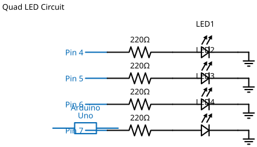

# Mission 1.7: The Tower Light

> **Role**: Security Architect  
> **Objective**: Illuminate a large outpost with four lights.

## Result Preview
>
>   
> *Red, White, Yellow, and Green LEDs turn ON.*

---

## 1. The Call to Adventure

A tall tower needs illumination on all four sides.
Your mission is to connect four high-power zones and ensure the security team can see everything in the dark.

## 2. The Toolkit

* **4x LEDs** (Red, White, Yellow, Green)
* **1x Arduino Uno**
* **8x Jumper Wires**
* **1x Breadboard**

## 3. The Blueprint

* **Red**: Pin 6
* **White**: Pin 5
* **Yellow**: Pin 4
* **Green**: Pin 3
* **GND**: Common Ground



*Schematic Diagram — Logical Wiring*


*Breadboard Photo — Physical Assembly Reference*

## 4. The Logic

**Algorithm:**

1. **Define**: Pins 6, 5, 4, 3.
2. **Setup**: All to `OUTPUT`.
3. **Loop**: Turn all `HIGH`.

### The Code

```cpp
// Mission 1.7: The Tower Light
const int p1 = 6;
const int p2 = 5;
const int p3 = 4;
const int p4 = 3;

void setup() {
  pinMode(p1, OUTPUT);
  pinMode(p2, OUTPUT);
  pinMode(p3, OUTPUT);
  pinMode(p4, OUTPUT);
}

void loop() {
  digitalWrite(p1, HIGH);
  digitalWrite(p2, HIGH);
  digitalWrite(p3, HIGH);
  digitalWrite(p4, HIGH);
}
```

## 5. Upload & Test

1. Upload the code.
2. Check the "Tower"—are all four sides glowing?
3. **Challenge**: Can you make the tower "power down" by setting all pins to `LOW` in the loop?

## 6. Troubleshooting

* **Green LED is dim?** Green LEDs often need slightly more voltage or the wire might be loose. Jiggle Pin 3!
* **Wait, where is Ground?** If your breadboard is full, use the "GND Rail" (the Blue line) to connect all short legs of the LEDs together with one wire going to the Arduino GND.
