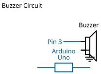

# Mission 1.12: The Morse Code

> **Role**: Communication Officer  
> **Objective**: Send a secret message across the airwaves.

## Result Preview
>
>   
> *The buzzer pulses in a short-long-short signal.*

---

## 1. The Call to Adventure

Before the internet, messages were sent using pulses of sound. This is called Morse Code.
Your mission is to pulse the buzzer to communicate a simple "Alert" signal.

## 2. The Toolkit

* **1x Buzzer**
* **1x Arduino Uno**
* **2x Jumper Wires**
* **1x Breadboard**

## 3. The Blueprint

* **Positive Leg (+)** -> **Pin 3**
* **Negative Leg (-)** -> **GND**



*Schematic Diagram — Logical Wiring*


*Breadboard Photo — Physical Assembly Reference*

## 4. The Logic

**Algorithm:**

1. **Short Pulse**: ON for 200ms, OFF for 200ms.
2. **Long Pulse**: ON for 800ms, OFF for 200ms.

### The Code

```cpp
// Mission 1.12: The Morse Code
const int buzzer = 3;

void setup() {
  pinMode(buzzer, OUTPUT);
}

void loop() {
  // Dot (Short)
  digitalWrite(buzzer, HIGH); delay(200);
  digitalWrite(buzzer, LOW);  delay(200);

  // Dash (Long)
  digitalWrite(buzzer, HIGH); delay(800);
  digitalWrite(buzzer, LOW);  delay(200);
}
```

## 5. Upload & Test

1. Upload the code.
2. Can you hear the rhythm?
3. **Challenge**: Can you find the SOS signal online and program it? (S = ···, O = ---)

## 6. Troubleshooting

* **Rhythm is messy?** Check your `delay()` numbers. They determine the "speed" of your speech.
* **Buzzer fell out?** Buzzers are heavy. Make sure it's pushed firmly into the breadboard.
