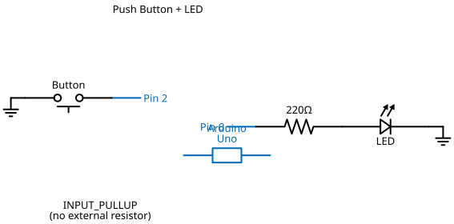

# Mission 1.15: The Tri-Power Array

> **Role**: Grid Controller  
> **Objective**: Master a 3-way output system with a central override.

## Result Preview
>
>   
> *All three LEDs glow while the button is pressed.*

---

## 1. The Call to Adventure

Power grids are organized in tiers. Sometimes, we need a "Master Switch" that activates every system at once.
Your mission is to control three independent power sectors using a single mechanical input.

## 2. The Toolkit

* **1x Push Button**
* **3x LEDs** (Red, Green, Blue)
* **1x Arduino Uno**
* **7x Jumper Wires**
* **1x Breadboard**

## 3. The Blueprint

* **Button**: Pin 13
* **Signal Pins**: 12, 9, 4
* **GND**: Common Ground for all components.



*Schematic Diagram — Logical Wiring*


*Breadboard Photo — Physical Assembly Reference*

## 4. The Logic

**Algorithm:**

1. **Setup**: Define inputs and outputs.
2. **Process**: If input is `LOW`, activate all 3 outputs.

### The Code

```cpp
// Mission 1.15: The Tri-Power Array
const int masterPin = 13;
const int sector1 = 12;
const int sector2 = 9;
const int sector3 = 4;

void setup() {
  pinMode(sector1, OUTPUT);
  pinMode(sector2, OUTPUT);
  pinMode(sector3, OUTPUT);
  pinMode(masterPin, INPUT_PULLUP);
}

void loop() {
  if (digitalRead(masterPin) == LOW) {
    digitalWrite(sector1, HIGH);
    digitalWrite(sector2, HIGH);
    digitalWrite(sector3, HIGH);
  } else {
    digitalWrite(sector1, LOW);
    digitalWrite(sector2, LOW);
    digitalWrite(sector3, LOW);
  }
}
```

## 5. Upload & Test

1. Upload the code.
2. Press the button. Does the whole array come alive?
3. **Upgrade**: Can you make the LEDs cascade (1 -> 2 -> 3) only while you hold the button?

## 6. Troubleshooting

* **Button feels "sticky"?** If you are using a breadboard, ensure the button pins are not touching other component wires.
* **Ground loop?** If the lights flicker, check that the GND wire from the Arduino is firmly connected to the breadboard rail.
