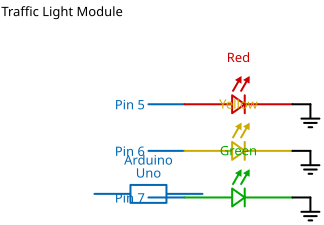

# Mission 1.22: Green Means GO

> **Role**: Flow Manager  
> **Objective**: Open the gates and let the traffic flow.

## Result Preview
>
>   
> *The Green light turns ON. The intersection is OPEN.*

---

## 1. The Call to Adventure

The wait is over. The road is clear.
Your mission is to activate the final beacon in the system: the Green light. This is the signal every driver is waiting for!

## 2. The Toolkit

* **1x Traffic Light Module**
* **1x Arduino Uno**
* **4x Jumper Wires**

## 3. The Blueprint

* **G (Green)** -> **Pin 7**
* **GND** -> **GND**



*Schematic Diagram — Logical Wiring*


*Breadboard Photo — Physical Assembly Reference*

## 4. The Logic

**Algorithm:**

1. **Define**: `greenLight` is Pin 7.
2. **Setup**: Pin 7 as `OUTPUT`.
3. **Loop**: Turn Pin 7 `HIGH`.

### The Code

```cpp
// Mission 1.22: Green Means GO!
const int greenLight = 7;

void setup() {
  pinMode(greenLight, OUTPUT);
}

void loop() {
  digitalWrite(greenLight, HIGH); // GO! GO! GO!
}
```

## 5. Upload & Test

1. Upload the code.
2. Behold the Green glow!
3. **Final Test**: Can you write code that turns ON the Green light but keeps the Red and Yellow lights OFF?

## 6. Troubleshooting

* **Green light is dim?** Check the wire at Pin 7. Some Green LEDs need a very tight connection.
* **Code Error?** Ensure you don't have two `void loop()` sections in your file.
