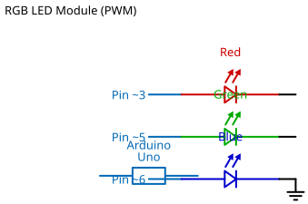

# Mission 1.26: The Crimson Pulse

> **Role**: Emergency Coordinator  
> **Objective**: Program a rhythmic Red beacon.

## Result Preview
>
>   
> *The Red channel pulses ON and OFF.*

---

## 1. The Call to Adventure

A steady light may be ignored, but a pulsing light demands attention.
Your mission is to program the Red channel of your RGB module to blink, creating a signal for nearby responders.

## 2. The Toolkit

* **1x RGB LED Module**
* **1x Arduino Uno**
* **2x Jumper Wires**

## 3. The Blueprint

* **R (Red)** -> **Pin 5**
* **- (Common)** -> **GND**



*Schematic Diagram — Logical Wiring*


*Breadboard Photo — Physical Assembly Reference*

## 4. The Logic

**Algorithm:**

1. Turn Red ON.
2. Wait 1 second.
3. Turn Red OFF.
4. Wait 1 second.

### The Code

```cpp
// Mission 1.26: The Crimson Pulse
const int red = 5;

void setup() {
  pinMode(red, OUTPUT);
}

void loop() {
  digitalWrite(red, HIGH); delay(1000);
  digitalWrite(red, LOW);  delay(1000);
}
```

## 5. Upload & Test

1. Upload the code.
2. Does the signal feel like an alarm?
3. **Upgrade**: Can you make it blink 5 times faster? (Hint: Change the delay to `200`).

## 6. Troubleshooting

* **Flashes once then stops?** Check your loop curly brackets `{}`.
* **Other colors flashing?** Disconnect any stray wires on Pins 6 or 7.
