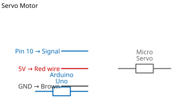

# Mission 1.33: The Robotic Joint

> **Role**: Robotics Engineer  
> **Objective**: Control a motor that acts like a human joint—moving to precise angles.

## Result Preview
>
>   
> *The Servo Arm moves: 0° -> 90° -> 180°.*

---

## 1. The Call to Adventure

Normal motors just spin round and round (like a fan). But robots need precision. They need to wave, grab, and walk.
For this, we use the **Servo Motor**. It doesn't spin; it **points**.
Your mission is to program the motor to move to specific coordinates.

## 2. The Toolkit

* **1x Micro Servo** (The Muscle)
* **1x Arduino Uno**
* **3x Jumper Wires**

## 3. The Blueprint

The Servo has 3 wires. Watch the colors carefully!

* **Brown/Black** -> **GND**
* **Red** -> **5V**
* **Orange/Yellow** -> **Pin 10** (Signal)



*Schematic Diagram — Logical Wiring*


*Breadboard Photo — Physical Assembly Reference*

> [!WARNING]
> **Don't force the arm!** Turning the servo gears by hand can strip them. Let the code do the moving.

## 4. The Logic

To control a servo, we need a special library called `<Servo.h>`.

**Step-by-Step:**

1. **Include**: Load the library.
2. **Attach**: Tell the Arduino the Servo is on Pin 10.
3. **Write**: Send an angle (0 to 180).

### The Code

```cpp
// Mission 1.33: The Robotic Joint
#include <Servo.h> 

Servo myRobotArm;   

void setup() {
  myRobotArm.attach(10); // Connect to Pin 10
}

void loop() {
  myRobotArm.write(0);   delay(1000); // Point Left
  myRobotArm.write(90);  delay(1000); // Point Center
  myRobotArm.write(180); delay(1000); // Point Right
}
```

## 5. Upload & Test

1. Upload the code.
2. Watch the arm. Does it move smoothly between the three positions?
3. **Upgrade**: Can you make it move to `45` and `135` degrees?

## 6. Troubleshooting

* **Arm just vibrates?** This means it’s struggling for power. Try a different USB port.
* **Not moving?** Check the Red wire. Is it in **5V**? Servos cannot run on 3.3V.
