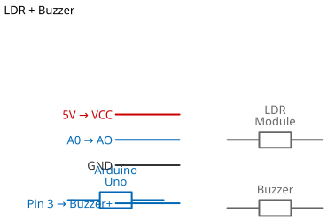

# Mission 2.10: The Sunrise Alarm

> **Role**: Sleep Technologist  
> **Objective**: Build an alarm that wakes you up when the sun rises.

## Result Preview
>
>   
> *Light hits sensor -> Alarm BEEPS.*

---

## 1. The Call to Adventure

Waking up to a loud alarm in the dark is terrible.
Your mission is to build a gentle alarm that only triggers when it sees natural light.

## 2. The Toolkit

* **1x LDR Sensor** (Input)
* **1x Buzzer** (Output)
* **1x Arduino Uno**

## 3. The Blueprint

* **LDR**: Pin A0
* **Buzzer +**: Pin 2
* **Buzzer -**: GND



*Schematic Diagram — Logical Wiring*


*Breadboard Photo — Physical Assembly Reference*

## 4. The Logic

**Algorithm:**

1. **Sleep**: Wait for Light > 500 (Morning).
2. **Wake Up**: Trigger Buzzer.
3. **Snooze**: Silence if light drops again (e.g., covered by a pillow).

### The Code

```cpp
// Mission 2.10: Sunrise Alarm
const int ldrPin = A0;
const int buzzerPin = 2; // Fixed from legacy 'DO_PIN' confusion

void setup() {
  pinMode(buzzerPin, OUTPUT);
  Serial.begin(9600);
}

void loop() {
  int brightness = analogRead(ldrPin);
  Serial.println(brightness);

  // If it's bright (Daytime)
  if (brightness > 500) {
    // Beep Beep!
    digitalWrite(buzzerPin, HIGH);
    delay(100);
    digitalWrite(buzzerPin, LOW);
    delay(100);
  } else {
    // Shhh... sleeping
    digitalWrite(buzzerPin, LOW);
  }
}
```

## 5. Upload & Test

1. Upload code.
2. Cover the sensor (simulate Night). Silence?
3. Shine a light (simulate Morning). Beep?

## 6. Troubleshooting

* **Beeps immediately?**
  * Your room is too bright! Increase `500` to `800` or cover the sensor with a cup.

## 7. Extensions & Upgrades

**Challenge**: The Rooster

* **Upgrade**: Can you make the beeping get faster as it gets brighter?
