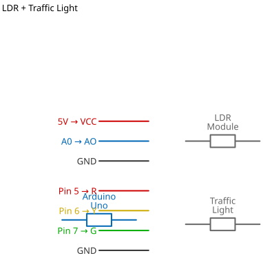

# Mission 2.12: Smart Night Mode

> **Role**: City Operations Manager  
> **Objective**: Modify the traffic lights. At night, they should save energy and just blink yellow.

## Result Preview
>
>   
> *Daytime -> Normal Cycle (R-Y-G). Night -> Blinking Yellow.*

---

## 1. The Call to Adventure

In the middle of the night, waiting for a green light when no one is around is annoying.
Major cities switch to "Caution Mode" (Blinking Yellow) at night.
Your mission is to automate this using the **LDR**.

## 2. The Toolkit

* **1x Traffic Light Module**
* **1x LDR Sensor**
* **1x Arduino Uno**

## 3. The Blueprint

* **Traffic Light**: 5, 6, 7 (R, Y, G)
* **LDR**: A0 (Analog)




*Schematic Diagram — Logical Wiring*


## 4. The Logic

**Algorithm:**

1. **Check Light Level**.
2. **IF Dark (< 300)**:
    * Blink Yellow (ON 500ms, OFF 500ms).
3. **ELSE (Day)**:
    * Run Standard Traffic Cycle (Red -> Green -> Yellow).

### The Code

```cpp
// Mission 2.12: Smart Night Mode
const int ldrPin = A0;
const int red = 5;
const int yellow = 6;
const int green = 7;

void setup() {
  pinMode(red, OUTPUT);
  pinMode(yellow, OUTPUT);
  pinMode(green, OUTPUT);
  Serial.begin(9600);
}

void loop() {
  int brightness = analogRead(ldrPin);
  
  if (brightness < 300) {
    // NIGHT MODE: Blink Yellow
    digitalWrite(red, LOW);
    digitalWrite(green, LOW);
    
    digitalWrite(yellow, HIGH);
    delay(500);
    digitalWrite(yellow, LOW);
    delay(500);
  } else {
    // DAY MODE: Normal Cycle
    // Red
    digitalWrite(red, HIGH);
    delay(2000);
    digitalWrite(red, LOW);
    
    // Green
    digitalWrite(green, HIGH);
    delay(2000);
    digitalWrite(green, LOW);
    
    // Yellow
    digitalWrite(yellow, HIGH);
    delay(1000);
    digitalWrite(yellow, LOW);
  }
}
```

## 5. Upload & Test

1. Upload code.
2. Cover the LDR. Does it switch to Yellow Blinking?
3. Uncover. Does it go back to Red/Green/Yellow?

## 6. Troubleshooting

* **Stuck in Night Mode?**
  * Your room is too dark. Decrease `300` to `100`.
* **Traffic Light mixing colors?**
  * Ensure we `digitalWrite(LOW)` the previous light before turning the next one `HIGH`.
