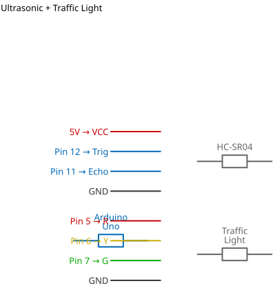

# Mission 2.3: Smart Intersection

> **Role**: Civil Engineer  
> **Objective**: Automate traffic flow using distance sensors. Slow cars down, then stop them.

## Result Preview
>
>   
> *Car far? Green. Car close? Yellow. Car stopped? Red.*

---

## 1. The Call to Adventure

Traffic jams start when cars stop unnecessarily. A **Smart Traffic Light** can see cars coming and adjust.
Your mission is to write the logic for this intersection.

## 2. The Toolkit

* **1x Traffic Light Module**
* **1x Ultrasonic Sensor**
* **1x Arduino Uno**

## 3. The Blueprint

* **Traffic Light**: R=Pin 5, Y=Pin 6, G=Pin 7.
* **Ultrasonic**: Trig=Pin 12, Echo=Pin 11.
* **Power**: VCC=5V, GND=GND.



*Schematic Diagram — Logical Wiring*


*Breadboard Photo — Physical Assembly Reference*

## 4. The Logic

**Algorithms for the Road:**

1. **Poll**: Check distance every 100ms.
2. **Evaluate**:
    * **Zone 1 (< 10cm)**: STOP! (Red).
    * **Zone 2 (< 30cm)**: CAUTION (Yellow).
    * **Zone 3 (> 30cm)**: CLEAR (Green).

### The Code

```cpp
// Mission 2.3: Smart Intersection
const int redPin = 5;
const int yellowPin = 6;
const int greenPin = 7;
const int trigPin = 12;
const int echoPin = 11;

void setup() {
  Serial.begin(9600);
  pinMode(redPin, OUTPUT);
  pinMode(yellowPin, OUTPUT);
  pinMode(greenPin, OUTPUT);
  pinMode(trigPin, OUTPUT);
  pinMode(echoPin, INPUT);
}

void loop() {
  // 1. Ping
  digitalWrite(trigPin, LOW);
  delayMicroseconds(2);
  digitalWrite(trigPin, HIGH);
  delayMicroseconds(10);
  digitalWrite(trigPin, LOW);
  
  // 2. Listen
  long duration = pulseIn(echoPin, HIGH);
  int distance = duration * 0.034 / 2;
  
  // 3. Reset Lights (Turn all off first)
  digitalWrite(redPin, LOW);
  digitalWrite(yellowPin, LOW);
  digitalWrite(greenPin, LOW);

  // 4. Decision Matrix
  if (distance < 10) {
    digitalWrite(redPin, HIGH); // STOP
  } else if (distance < 30) {
    digitalWrite(yellowPin, HIGH); // SLOW
  } else {
    digitalWrite(greenPin, HIGH); // GO
  }
  
  delay(100);
}
```

## 5. Upload & Test

1. Upload code.
2. Move your hand towards the sensor to simulate a car.
3. Watch the lights change from Green -> Yellow -> Red.

## 6. Troubleshooting

* **Yellow Light skipped?**
  * You might be moving your hand too fast! The sensor needs time to read.
* **All lights dim?**
  * Check if you missed a Ground (GND) wire.

## 7. Extensions & Upgrades

**Challenge**: The Crosswalk

* **Upgrade**: Add a "Push Button". If a pedestrian presses it, force the Light to RED immediately.
