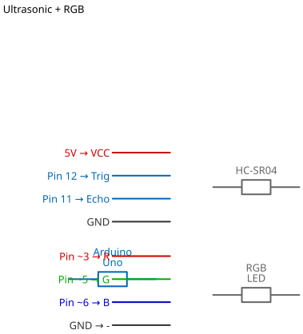

# Mission 2.4: Visual Rangefinder

> **Role**: Surveying Engineer  
> **Objective**: Create a measuring tool that uses color to indicate distance.

## Result Preview
>
>   
> *Green (Safe) -> Red (Close).*

---

## 1. The Call to Adventure

Surveyors need to know if an area is safe to enter.
Your mission is to build a handheld device that turns **Red** if an obstacle is too close, warning the user before they bump into it.

## 2. The Toolkit

* **1x Ultrasonic Sensor**
* **1x RGB Module**
* **1x Arduino Uno**

## 3. The Blueprint

* **RGB**: Pins 3, 5, 6 (PWM).
* **Ultrasonic**: Trig=12, Echo=11.



*Schematic Diagram — Logical Wiring*


*Breadboard Photo — Physical Assembly Reference*

## 4. The Logic

This logic uses "Thresholds".

* **Threshold 1**: 20cm.
* **Rule**: If closer than 20cm, show RED. Otherwise, show GREEN.

### The Code

```cpp
// Mission 2.4: Visual Rangefinder
const int redPin = 3;
const int greenPin = 5;
const int bluePin = 6;
const int trigPin = 12;
const int echoPin = 11;

void setup() {
  Serial.begin(9600);
  pinMode(redPin, OUTPUT);
  pinMode(greenPin, OUTPUT);
  pinMode(bluePin, OUTPUT);
  pinMode(trigPin, OUTPUT);
  pinMode(echoPin, INPUT);
}

void loop() {
  // 1. Measure
  digitalWrite(trigPin, LOW);
  delayMicroseconds(2);
  digitalWrite(trigPin, HIGH);
  delayMicroseconds(10);
  digitalWrite(trigPin, LOW);
  
  long duration = pulseIn(echoPin, HIGH);
  int distance = duration * 0.034 / 2;
  
  // 2. Logic (Threshold = 20cm)
  if (distance < 20) {
    setColor(255, 0, 0); // Red
  } else {
    setColor(0, 255, 0); // Green
  }
  
  delay(100);
}

void setColor(int r, int g, int b) {
  analogWrite(redPin, r);
  analogWrite(greenPin, g);
  analogWrite(bluePin, b);
}
```

## 5. Upload & Test

1. Upload code.
2. Walk towards a wall.
3. Does it change color at 20cm?

## 6. Troubleshooting

* **Colors mixing?**
  * Ensure GND is connected. Floating ground causes random colors.
* **Sensor blind?**
  * Ultrasonic sensors struggle with soft fabrics (clothes). Try a hard surface like a book or wall.

## 7. Extensions & Upgrades

**Challenge**: The Proximity Gradient

* **Upgrade**: Can you make it fade from Green to Red smoothly as you get closer? (Advanced Math: Map distance 0-50 to color 255-0).
