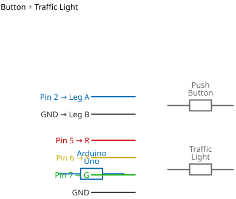

# Mission 2.7: The Crosswalk

> **Role**: Urban Planner  
> **Objective**: Keep pedestrians safe. Stop cars when someone wants to cross.

## Result Preview
>
>   
> *Green Light (Cars Go). Press Button -> Yellow -> Red (Cars Stop).*

---

## 1. The Call to Adventure

Drivers don't always stop for people. We need a signal.
Your mission is to build a "Demand-Actuated Signal"—a fancy word for a crosswalk button.

## 2. The Toolkit

* **1x Push Button**
* **1x Traffic Light Module**
* **1x Arduino Uno**

## 3. The Blueprint

* **Traffic Light**: 5, 6, 7 (R, Y, G)
* **Button**: Pin 2 (GND Leg)



*Schematic Diagram — Logical Wiring*


*Breadboard Photo — Physical Assembly Reference*

## 4. The Logic

**State Machine:**

1. **Default**: Green Light ON (Cars moving).
2. **Trigger**: Button Pressed?
3. **Action**:
    * Green OFF.
    * Yellow ON (2 sec).
    * Red ON (5 sec) -> **Pedestrians Cross**.
    * Red OFF, Green ON.

### The Code

```cpp
// Mission 2.7: Crosswalk
const int buttonPin = 2;
const int red = 5;
const int yellow = 6;
const int green = 7;

void setup() {
  pinMode(buttonPin, INPUT_PULLUP);
  pinMode(red, OUTPUT);
  pinMode(yellow, OUTPUT);
  pinMode(green, OUTPUT);
  
  // Start with Green
  digitalWrite(green, HIGH);
}

void loop() {
  int request = digitalRead(buttonPin);
  
  if (request == LOW) {
    // Pedestrian wants to cross!
    changeLights();
  }
}

void changeLights() {
  // 1. Slow down cars
  digitalWrite(green, LOW);
  digitalWrite(yellow, HIGH);
  delay(2000);
  
  // 2. Stop cars
  digitalWrite(yellow, LOW);
  digitalWrite(red, HIGH);
  
  // 3. Walk Time
  delay(5000); 
  
  // 4. Return to normal
  digitalWrite(red, LOW);
  digitalWrite(green, HIGH);
}
```

## 5. Upload & Test

1. Upload code.
2. Wait. The Green light should be on.
3. Press the button. Does it cycle through Yellow to Red?

## 6. Troubleshooting

* **Button resets Arduino?**
  * Short circuit! Check if you connected the button directly between 5V and GND. It should be Pin 2 and GND.

## 7. Extensions & Upgrades

**Challenge**: The Buzzer

* **Upgrade**: Add a "Beep... Beep..." sound when the Red light is on so blind people know it's safe to walk.

## PROGRAMMING

**Step 1:** Open your Arduino IDE. See how to set up here: [Getting Started](../../getting-started/overview.md).

**Step 2:** Type ```const int Button = 2;``` as shown in the picture below.

.

**Step 3:** Type ```int RED = 3;``` as shown in the picture below.

.

**Step 4:** Type ```int YELLOW = 3;``` as shown in the picture below.

.

**Step 5:** Type ```int GREEN = 3;``` as shown in the picture below.

.

**Step 6:** Type ```int buttonState= 0;``` as shown in the picture below.

.

**Step 7:** After the (void setup ()) within the curly brackets type

``` cpp
pinMode (ButtonPin, INTPUT_PULLUP); 
pinMode (RED, OUTPUT);
pinMode (YELLOW, OUTPUT);
pinMode (GREEN, OUTPUT);

```

.

**Step 8:** After the (void loop ()) within the curly brackets type as shown below

``` cpp
buttonState = digitalRead (ButtonPin); 
```

.

**Step 9:**  Type Function

``` cpp
 if (buttonState == HIGH) {
digitalWrite (GREEN, HIGH); 
} else
```

.

**Step 10:** Type Function

``` cpp
if (buttonState == LOW) {
digitalWrite (GREEN, HIGH); 
delay (1000);
digitalWrite (GREEN, LOW); 
delay (1000);
digitalWrite (YELLOW, HIGH); 
delay (2000);
digitalWrite (YELLOW, LOW); 
delay (1000);
digitalWrite (RED, LOW); 
delay (5000);
digitalWrite (RED, LOW); 
delay (1000);
digitalWrite (GREEN, LOW); 
} 
```

.

.

**Step 11:** Save your code. *See the [Getting Started](../../getting-started/overview.md) section*

**Step 12:** Select the arduino board and port *See the [Getting Started](../../getting-started/overview.md) section:Selecting Arduino Board Type and Uploading your code*.

**Step 13:** Upload your code. *See the [Getting Started](../../getting-started/overview.md) section:Selecting Arduino Board Type and Uploading your code*

## CONCLUSION

If you encounter any problems when trying to upload your code to the board, run through your code again to check for any errors or missing lines of code. If you did not encounter any problems and the program ran as expected, Congratulations on a job well done.
