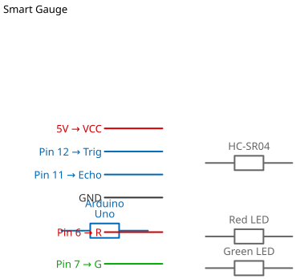

# Mission 3.1: The City Dashboard

> **Role**: City Planner  
> **Objective**: Build a visual status board to monitor critical infrastructure (like a Water Tower).

## Result Preview
>
>   
> *Green means SAFE. Red means DANGER (too close).*

---

## 1. The Call to Adventure

In the **Smart City**, data is useless if humans can't read it. A City Mayor doesn't want to see "Distance = 3cm". They want to see **"Green = Safe"** or **"Red = Danger"**.

We need a system that takes raw data (Distance) and converts it into a visual status update.

## 2. The Toolkit

* **1x Ultrasonic Sensor**: The Monitor.
* **1x Green LED**: "Safe" Indicator.
* **1x Red LED**: "Danger" Indicator.
* **2x Resistors** (330 Ohm): Protection for LEDs.

## 3. The Blueprint

Construct the circuit on your breadboard:

* **Ultrasonic**: Same as Mission 2.1 (Trig->9, Echo->10).
* **Red LED**: Positive -> **Pin 6**.
* **Green LED**: Positive -> **Pin 7**.



*Schematic Diagram — Logical Wiring*


*Breadboard Photo — Physical Assembly Reference*

## 4. The Logic

We are building a **State Machine**. Here is the step-by-step logic:

1. **Measure**: Ask the sensor for distance (in cm).
2. **Analyze**:
    * **IF** distance < 10cm: Situation is **CRITICAL**.
    * **ELSE**: Situation is **NORMAL**.
3. **Display**:
    * **Critical**: Turn Red LED **ON**, Green LED **OFF**.
    * **Normal**: Turn Green LED **ON**, Red LED **OFF**.

### The Code

```cpp
// Mission 3.1: The City Dashboard
const int trigPin = 9;
const int echoPin = 10;
const int redLed = 6;
const int greenLed = 7;

long duration;
int distance;

void setup() {
  pinMode(trigPin, OUTPUT);
  pinMode(echoPin, INPUT);
  pinMode(redLed, OUTPUT);
  pinMode(greenLed, OUTPUT);
  Serial.begin(9600);
}

void loop() {
  // 1. Measure Distance
  digitalWrite(trigPin, LOW);
  delayMicroseconds(2);
  digitalWrite(trigPin, HIGH);
  delayMicroseconds(10);
  digitalWrite(trigPin, LOW);
  
  duration = pulseIn(echoPin, HIGH);
  distance = duration * 0.034 / 2;

  // 2. The Decision Logic
  if (distance < 10) { 
    // DANGER STATE (Water level too high!)
    digitalWrite(redLed, HIGH);
    digitalWrite(greenLed, LOW);
    Serial.println("STATUS: CRITICAL WARNING");
  } 
  else {
    // SAFE STATE
    digitalWrite(redLed, LOW);
    digitalWrite(greenLed, HIGH);
    Serial.println("STATUS: NORMAL");
  }
  
  delay(500); // Update twice a second
}
```

## 5. The Debrief

Watch your dashboard. As you move your hand closer, the city's status should change instantly from **Green** to **Red**.

## 6. Troubleshooting

* **Both LEDs off?**
  * Check if you added `pinMode(OUTPUT)` for both LEDs.
* **Ultrasonic not reading?**
  * Note that we changed pins for this Mission (Trig is 9, Echo is 10). Did you move the wires?

## 7. Extensions & Upgrades

**Challenge**: Can you add a Yellow LED for "Warning"?

* **Logic**: Add an `else if` block.
  * `if (distance < 10)` -> Red
  * `else if (distance < 20)` -> Yellow
  * `else` -> Green
