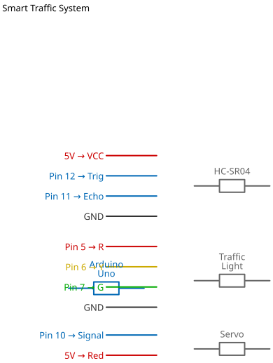

# Mission 3.3: Adaptive Traffic System

> **Role**: Traffic Control Engineer  
> **Objective**: Reduce traffic jams. The light should stay Green if no cars are waiting on the other side.

## Result Preview
>
>   
> *Car approaches (Ultrasonic < 10cm) -> Light turns Red to stop it? Or Green to let it go?*
> *Correction: Usually "Smart" means "Green for the busy lane". Let's assume the sensor is watching the "Cross Street". If car detected, give them Green.*

---

## 1. The Call to Adventure

Old traffic lights are dumb. They maintain Red even when no one is crossing.
Your mission is to build a system that senses cars and changes the light dynamically.

## 2. The Toolkit

* **1x Ultrasonic Sensor** (Vehicle Detector)
* **1x Traffic Light Module**
* **1x Arduino Uno**

## 3. The Blueprint

* **Ultrasonic Trig**: Pin 9
* **Ultrasonic Echo**: Pin 10
* **Traffic Lights**: 6 (R), 7 (Y), 8 (G)
* **GND**: Common Ground




*Schematic Diagram — Logical Wiring*


## 4. The Logic

**Scenario**: The sensor is on the "Main Road".

1. **Default**: Red (Stop).
2. **Detection**: If car arrives (Distance < 10cm).
3. **Action**: Cycle Green -> Yellow -> Red.

### The Code

```cpp
// Mission 3.3: Smart Traffic Light
const int trigPin = 9;
const int echoPin = 10;
const int red = 6;
const int yellow = 7;
const int green = 8;

void setup() {
  pinMode(trigPin, OUTPUT);
  pinMode(echoPin, INPUT);
  pinMode(red, OUTPUT);
  pinMode(yellow, OUTPUT);
  pinMode(green, OUTPUT);
  Serial.begin(9600);
  
  // Start Red
  digitalWrite(red, HIGH);
}

void loop() {
  long duration, distance;
  
  // Ping
  digitalWrite(trigPin, LOW); 
  delayMicroseconds(2);
  digitalWrite(trigPin, HIGH);
  delayMicroseconds(10);
  digitalWrite(trigPin, LOW);
  
  duration = pulseIn(echoPin, HIGH);
  distance = (duration / 2) / 29.1;
  
  Serial.println(distance);

  // If Car is waiting (< 10cm) AND currently Red
  if (distance > 0 && distance < 10) {
    // Give them the Green Light!
    triggerGreenSequence();
  }
  
  delay(100);
}

void triggerGreenSequence() {
  // Red OFF, Green ON
  digitalWrite(red, LOW);
  digitalWrite(green, HIGH);
  delay(5000); // 5 Seconds of Green
  
  // Green OFF, Yellow ON
  digitalWrite(green, LOW);
  digitalWrite(yellow, HIGH);
  delay(2000); // 2 Seconds of Caution
  
  // Yellow OFF, Red ON
  digitalWrite(yellow, LOW);
  digitalWrite(red, HIGH);
  
  delay(2000); // Safety pause
}
```

## 5. Upload & Test

1. Upload code.
2. Red light should be ON.
3. Move your hand in front of the ultrasonic sensor (Simulate "Car Arriving").
4. Light should switch to Green, then Yellow, then back to Red.

## 6. Troubleshooting

* **Nothing happens?**
  * Verify Pins: Trig=9, Echo=10.
  * Check Serial Monitor for distance values.
