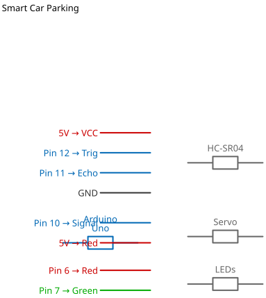

# Mission 3.5: The Automated Garage

> **Role**: Parking Systems Engineer  
> **Objective**: Build a barrier that opens automatically when a car arrives.

## Result Preview
>
>   
> *Car approaches -> RGB turns Red -> Barrier Opens -> Car Parks -> Barrier Closes -> RGB Green.*

---

## 1. The Call to Adventure

Manual garage doors are a hassle.
Your mission is to use the **Ultrasonic Sensor**, **Servo Motor**, and **RGB LED** to build a fully automated parking system.

## 2. The Toolkit

* **1x Ultrasonic Sensor** (Detector)
* **1x Servo Motor** (Barrier Gate)
* **1x RGB LED** (Status Light)
* **1x Arduino Uno**

## 3. The Blueprint

* **Ultrasonic Trig**: 6
* **Ultrasonic Echo**: 7
* **Servo Control**: 8
* **RGB Red**: 9
* **RGB Green**: 10
* **RGB Blue**: 11
* **VCC/GND**: As required.




*Schematic Diagram — Logical Wiring*


## 4. The Logic

**Algorithm:**

1. **Check Distance**.
2. **IF Car Detected (< 20cm)**:
    * RGB -> RED (Occupied/Busy).
    * Servo -> 0 degrees (Open Barrier).
    * Wait 5 seconds.
    * Servo -> 90 degrees (Close Barrier).
3. **ELSE (Empty)**:
    * RGB -> GREEN (Available).
    * Barrier stays Closed.

### The Code

```cpp
// Mission 3.5: Automated Garage
#include <Servo.h>

const int trig = 6;
const int echo = 7;
const int servoPin = 8;
const int red = 9;
const int green = 10;
const int blue = 11;

Servo barrier;
long duration;
int distance;

void setup() {
  pinMode(trig, OUTPUT);
  pinMode(echo, INPUT);
  
  pinMode(red, OUTPUT);
  pinMode(green, OUTPUT);
  pinMode(blue, OUTPUT);
  
  barrier.attach(servoPin);
  barrier.write(90); // Closed
  
  Serial.begin(9600);
}

void loop() {
  // 1. Measure Distance
  digitalWrite(trig, LOW); delayMicroseconds(2);
  digitalWrite(trig, HIGH); delayMicroseconds(10);
  digitalWrite(trig, LOW);
  
  duration = pulseIn(echo, HIGH);
  distance = duration * 0.034 / 2;
  
  Serial.println(distance);
  
  // 2. Logic
  if (distance > 0 && distance < 20) {
    // Car Arriving!
    openBarrier();
  } else {
    // Vacant
    setRGB(0, 255, 0); // Green
    barrier.write(90); // Keep Closed
  }
  
  delay(200);
}

void openBarrier() {
  setRGB(255, 0, 0); // Red (Busy)
  barrier.write(0);  // Open!
  delay(5000);       // Wait for car to enter
  barrier.write(90); // Close
  delay(1000);
}

void setRGB(int r, int g, int b) {
  analogWrite(red, r);
  analogWrite(green, g);
  analogWrite(blue, b);
}
```

## 5. Upload & Test

1. Upload code.
2. RG should be Green (Available).
3. Move hand closer (< 20cm).
4. RGB turns Red, Servo moves (Barrier Opens).

## 6. Troubleshooting

* **Servo jittery?**
  * Servos need good power. If it twitches, try a separate 5V supply or ensure Arduino USB is fully powered.
* **RGB colors wrong?**
  * Check 9, 10, 11 order.
